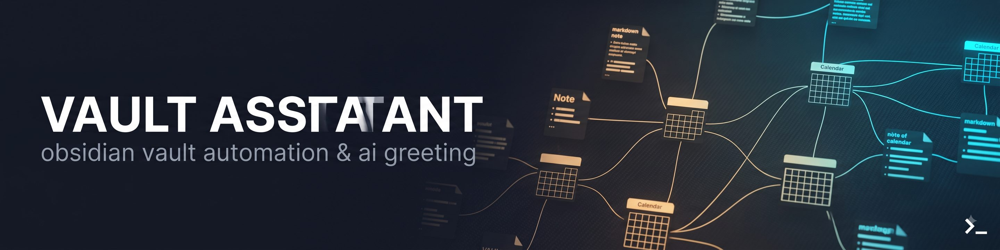

# Obsidian Vault Assistant

You write daily notes. Good. But Friday comes, and Monday is a blur. The End of Day section has been blank for three days. The weekly review template stares at you, empty.

This assistant lives in your terminal. It checks your vault health every session. It auto-fills your weekly review. When something needs attention, it asks once then gets out of your way.

```
✓ Cron OK | 3 EOD pending | 50 blocked
3 hari EOD belum diisi. Mau catat sekarang?
```

Tell it "vault quiet" and it remembers.

## Why

Daily notes compound fast. Ten days of notes is manageable. A hundred days is noise. Without structure, patterns hide. You don't notice the blocked count climbing until someone asks why the issue has been open for two weeks.

This assistant gives you a dashboard in every session. One line of JSON that tells you:

- Did cron run today?
- How many EODs are unfilled?
- Are blocked issues piling up?
- Is the weekly review done?
- What's the review rate this week?

It generates your weekly review from the data your daily notes already have. KPI charts, GitHub issues, mood and energy trends, retro suggestions. Monday morning, it's ready.

## Requirements

- Bash 4, Python 3.8+
- An Obsidian vault with daily/, weekly/, _logs/ structure
- [Obsidian plugins](docs/obsidian-plugins.md): Dataview, Obsidian Charts, Templater

Optional:
- gh CLI (for blocked and next issue tracking)
- OpenCode + OpenViking (for proactive AI greeting)
- [Google Calendar API](docs/google-calendar-setup.md) (for calendar sync)

## Install

```bash
git clone https://github.com/todayz/obsidian-vault-assistant.git
cd obsidian-vault-assistant
bash install.sh
```

The wizard walks through vault path, GitHub repo (optional), cron schedule, and OpenCode registration. Five minutes.

## Before You Start

Your vault needs three Obsidian plugins. Install them from Settings → Community plugins:

- [Dataview](https://obsidian.md/plugins?id=dataview) — KPI markers and weekly stats
- [Obsidian Charts](https://obsidian.md/plugins?id=obsidian-charts) — KPI trend charts
- [Templater](https://obsidian.md/plugins?id=templater-obsidian) — dynamic templates

See [docs/obsidian-plugins.md](docs/obsidian-plugins.md) for setup instructions and optional plugins.

Want Google Calendar sync? Follow [docs/google-calendar-setup.md](docs/google-calendar-setup.md).

## Usage

### Vault health

```bash
bash scripts/vault-status.sh --summary
# → ✓ Cron OK | 3 EOD pending | 50 blocked

bash scripts/vault-status.sh
# → full JSON
```

### Weekly review

```bash
# auto (current week)
bash scripts/weekly-cron.sh

# manual
python3 scripts/weekly_fill.py --force

# specific week
python3 scripts/weekly_fill.py --week 28 --year 2026

# custom vault path
python3 scripts/weekly_fill.py --vault /path/to/vault
```

### Daily tasks

```bash
bash scripts/daily-cron.sh     # telemetry + sync (yesterday)
bash scripts/catchup.sh        # after wake or login
python3 scripts/validate_daily.py  # check note structure
```

## Configuration

Copy `config.example.sh` to `config.sh` and set your vault path. Or run `bash install.sh` and it generates the file for you.

```bash
VAULT_DIR="/path/to/vault"
GH_OWNER="your-github-username"     # optional, for issues across all repos
```

## OpenCode Integration

This is where it gets proactive. With OpenCode and OpenViking, the vault skill loads at session start. It checks OpenViking for your greeting preference. If you haven't suppressed it, it runs vault-status.sh and greets you.

Add AGENTS.md to your vault root:

```markdown
## Session Start Protocol

1. Load vault skill: `skill vault`
2. Check OpenViking: `openviking_find "pref:vault greeting"`
3. If not suppressed: run `vault-status.sh --summary`
4. Show 1-line status + 1 action offer
```

Then register the skill in `~/.config/opencode/opencode.json`:

```json
{
  "skills": { "paths": ["/path/to/obsidian-vault-assistant/skill"] },
  "agent": {
    "orchestrator": {
      "skill_triggers": {
        "vault": ["vault", "obsidian", "daily note", "weekly review", "kpi"]
      }
    }
  }
}
```

## Project Structure

```
obsidian-vault-assistant/
├── install.sh                    setup wizard
├── config.example.sh             config template
├── config.sh                     your config (generated)
├── docs/
│   ├── obsidian-plugins.md       plugin guide
│   └── google-calendar-setup.md  GCP + OAuth tutorial
├── scripts/
│   ├── load_config.sh            shared config loader
│   ├── vault-status.sh           system status to JSON
│   ├── weekly_fill.py            weekly review generator
│   ├── weekly-cron.sh            weekly cron wrapper
│   ├── daily-cron.sh             daily telemetry
│   ├── catchup.sh                session catchup
│   ├── validate_daily.py         note validation
│   ├── kpi_feed.py               KPI markers
│   ├── trend_feed.py             trend charts
│   └── requirements.txt
├── skill/
│   └── SKILL.md                  OpenCode skill
└── assets/
    └── banner.jpg                repo banner
```

## License

MIT
